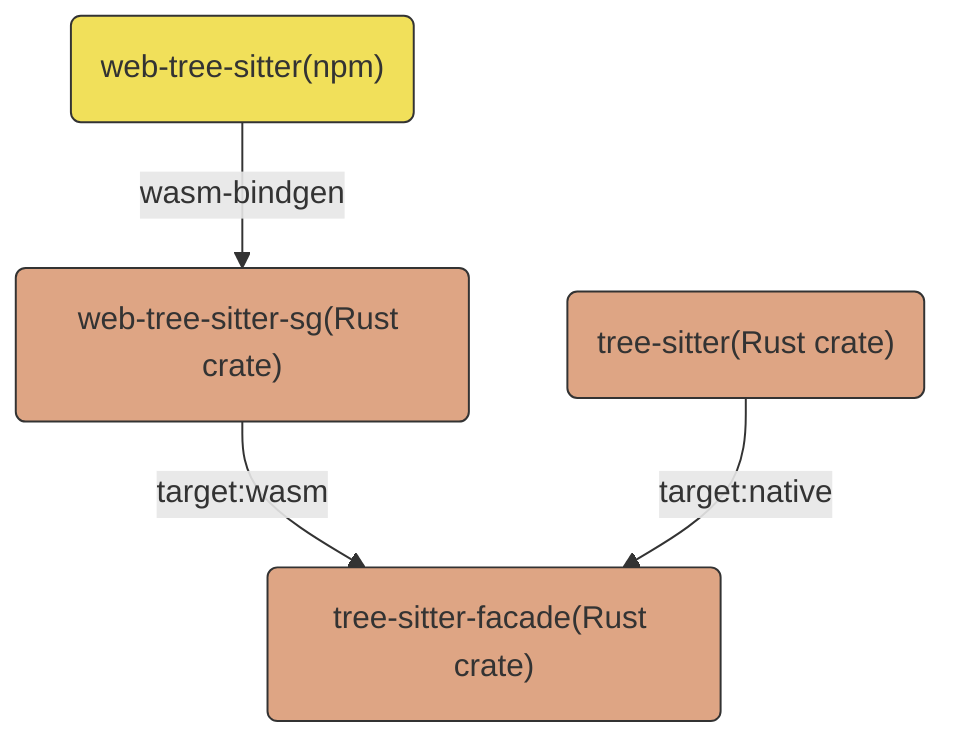

# rust-tree-sitter-wasm

This package provides binding to make tree-sitter work with Rust in browser.

## Architecture

```mermaid
graph TD;
web_ts_npm("web-tree-sitter(npm)") -->|wasm-bindgen| web_ts_sg_crate("web-tree-sitter-sg(Rust crate)")
web_ts_sg_crate -->|target:wasm| ts_facade_crate("tree-sitter-facade(Rust crate)")
ts_crate("tree-sitter(Rust crate)") -->|target:native| ts_facade_crate

classDef crate fill:#dea584,stroke:#333;
classDef npm fill:#f1e05a,stroke:#333;

class web_ts_npm npm;
class web_ts_sg_crate crate;
class ts_facade_crate crate;
class ts_crate crate;
```
